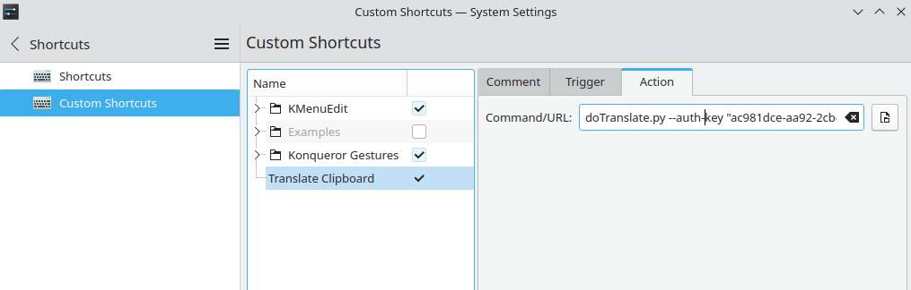

# Deepl Clipboard Translator

### **How does it work?**

The script begins by parsing your clipboard, translates the text you have in your last clipboard entry by calling the deepl api and copyies back the text translated.

### **How To execute it**
Is as simple as launching this command, passing to the script your api key and destination language
```bash
doTranslate.py --auth-key "ac9**********************86:fx" --dest-lang "IT"
```
Now you have your translated text in your clipboard, ready to paste!

### **How to use it in a practical manner**
I've set a shortcut to autolauch this script. So when i copy a text to the clipboard, i can press a combination of keys and i have a translated text ready in my keyboard to be pasted.

To acknowledge this task, do the following:
1.  Copy the python script in your user's home folder, under .local/bin
```bash
cp doTranslate.py /home/$USER/.local/bin
```
2.  Add this path to $PATH 
```bash
export PATH=$PATH:/home/$USER/.local/bin
```
3. Set up a shortcut in your system that executes the command.



### **ToDo**
- Exceptions when you reach api limit
- Manually choose input language
